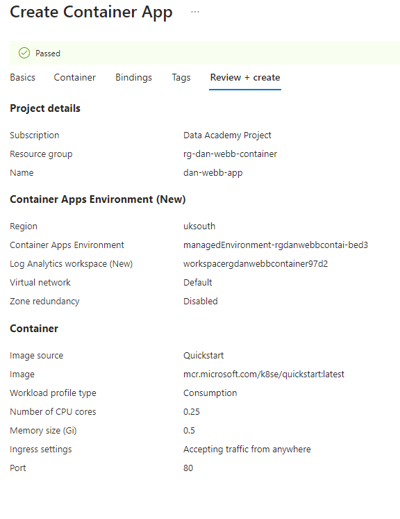
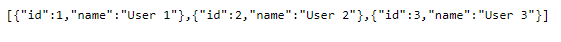

# Containerization

> This section assumes you have a basic knowledge of containers, and have previously pushed and pulled images from Docker Hub, as well as having the Go application created.

<!-- TOC -->

- [Containerization](#containerization)
    - [The Dockerfile](#the-dockerfile)
    - [How to create a Dockerfile from scratch](#how-to-create-a-dockerfile-from-scratch)
        - [1 ) Create the file](#1--create-the-file)
        - [2 ) The FROM command](#2--the-from-command)
        - [3 ) The WORKDIR command](#3--the-workdir-command)
        - [4 ) The COPY command](#4--the-copy-command)
        - [5 ) The RUN command](#5--the-run-command)
        - [6 ) The CMD command](#6--the-cmd-command)
        - [7 ) The ENV command](#7--the-env-command)
        - [8 ) The EXPOSE command](#8--the-expose-command)
- [Our Dockerfile](#our-dockerfile)
    - [With an In-Memory Database](#with-an-in-memory-database)
    - [With a Postgres Database & Goose Migrations](#with-a-postgres-database--goose-migrations)
- [Building our Image](#building-our-image)
    - [Running Your Image](#running-your-image)
        - [What's `-p 8080:8080`?](#whats--p-80808080)
- [Container Registry](#container-registry)
    - [Using a Private Container Registry (ACR)](#using-a-private-container-registry-acr)
    - [Log into ACR](#log-into-acr)
- [Login to Azure if not already logged in](#login-to-azure-if-not-already-logged-in)
- [Login to Azure if not already logged in](#login-to-azure-if-not-already-logged-in)
- [Login to ACR](#login-to-acr)
- [Login to ACR with Docker (follow the login prompts)](#login-to-acr-with-docker-follow-the-login-prompts)
- [NB. If the command asks for username when running in WSL. Cancel the operation and run this command from a windows cmd prompt](#nb-if-the-command-asks-for-username-when-running-in-wsl-cancel-the-operation-and-run-this-command-from-a-windows-cmd-prompt)
    - [Push an Image to ACR](#push-an-image-to-acr)
- [assuming we built our image with the following tags](#assuming-we-built-our-image-with-the-following-tags)
- [assuming we built our image with the following tags](#assuming-we-built-our-image-with-the-following-tags)
- [We tag the image with the ACR repo alias](#we-tag-the-image-with-the-acr-repo-alias)
- [Replace <team> with your team name (eg atari)](#replace-team-with-your-team-name-eg-atari)
- [Replace <user-id> with your name (eg dan-webb)>](#replace-user-id-with-your-name-eg-dan-webb)
- [Now we push](#now-we-push)
- [Now we push](#now-we-push)
- [Confirm it worked by pulling it](#confirm-it-worked-by-pulling-it)
- [Container App](#container-app)
    - [Not deployed anything on Azure before?](#not-deployed-anything-on-azure-before)
    - [Deploying Our App](#deploying-our-app)
        - [Creating the App](#creating-the-app)
        - [Complete Basic App Details](#complete-basic-app-details)
- [VS Code Extras](#vs-code-extras)
- [And finally...](#and-finally)

<!-- /TOC -->

We're going to be building our container using *Docker*.

## The Dockerfile

A Dockerfile is a script that contains instructions for building a customized docker image. Each instruction in a Dockerfile creates a new layer in the image, and the final image is composed of all the layers stacked on top of each other.

It includes instructions for installing dependencies, copying files, setting environment variables, and configuring the container.

The structure of a Dockerfile is based on a set of simple instructions, such as “FROM”, “RUN”, “COPY”, “ENV”, etc. 

Once a Dockerfile has been created, it can be used to build an image using the docker build command. 

## How to create a Dockerfile from scratch

> Pre-Requisite: Docker should be installed on your system

### 1) Create the file

Open your preferred IDE (such as VS Code) and navigate to your project directory. Create a new file in your project directory (at the root level) and name it `Dockerfile` (no file extension).


### 2) The FROM command 

The **FROM** instruction specifies the base image that the container will be built on top of. This instruction is typically the first one in a Dockerfile and is used to set the base image for the container. The format of the instruction is:

```docker
FROM <image>
```
For example,

```docker
FROM golang:1.22.3-alpine3.19
```

This instruction tells Docker to use the `golang:1.22.3-alpine3.19` image as the base image for the container. To use a specific version or tag of an image you can use:\<version> or:\<tag> syntax.

The `golang:1.22.3-alpine3.19` is the official Go 1.22 image based on Alpine Linux version 3.19.

### 3) The WORKDIR command

In a Dockerfile, the **WORKDIR** instruction sets the working directory for any command that follows it in the Dockerfile. This means that any commands that are run in the container will be executed relative to the specified directory. Below is the format of the instruction :

```docker
WORKDIR <directory>
```

For example,

```docker
WORKDIR /app
```

This instruction tells Docker to set the working directory of the container to `/app` . Any subsequent commands in the Dockerfile, such as **COPY**, **RUN**, or **CMD**, will be executed in this directory.

It’s important to note that the **WORKDIR** instruction creates the directory if it does not already exist. And the subsequent **COPY** and **ADD** commands will be executed relative to the **WORKDIR** specified.

### 4) The COPY command

Use the **COPY** instruction to copy local files from the host machine to the current working directory. For example, to copy a file named `package.json` from the host machine’s current directory to the image’s `/app` directory, you would use the following command:

```docker
COPY package.json /app/
```

If you want to copy all the files from the host’s current directory to the container’s current directory, you can use the below command:

```docker
COPY . .
```

It is used to copy all files and directories from the current directory on the host machine (indicated by “.”) to the current directory within the container.

The first “.” refers to the source directory on the host machine, and the second “.” refers to the destination directory within the container.

You can also use **ADD**:

```docker
ADD . /app
```

Copies the contents of the current directory (where the Dockerfile is located) into the /app directory inside the container. 

### 5) The RUN command

Use the **“RUN”** instruction to execute commands that will run during the image build process. The format of instruction is :

```docker
RUN <command_name>
```

For example, to make a folder inside the container named `app`, and build the go binary, you would use the following command:

```docker
RUN mkdir /app
RUN go build -o main .
```

### 6) The CMD command

In a Dockerfile, the CMD instruction sets the command that will be executed when a container is run from the image. The format of the instruction is:

```docker
CMD ["executable","param1","param2",...]
```

For example,

```docker
CMD ["/app/main"]
```

Builds the Go application located in the `/app` directory and creates an executable named `main` in the same directory. This assumes that there's a `main` package in the current directory that contains the `main` function.

Apart from all the instructions mentioned, there are some more instructions like **ENV**, and **EXPOSE** which are also used in creating Dockerfile. 

### 7) The ENV command

Use the **ENV** instruction to set environment variables inside the image which will be available during build time as well as in a running container. For example, to set the **DB_STRING** environment variable to production, you would use the following command:

```docker
ENV DB_STRING "postgres user:x password:y"
```

### 8) The EXPOSE command

Use the EXPOSE command to tell Docker which ports the container will listen on at runtime. For example, if your application listens on port 9000, you would use the following command:

```docker
EXPOSE 9000
```

---

# Our Dockerfile

Please choose **ONE** of the following two sections depending on whether you are using an *in-memory database* or have connected locally to a *Postgres database*.

## With an In-Memory Database

```docker
FROM golang:1.22.3-alpine3.19

RUN mkdir /app

ADD . /app

WORKDIR /app

EXPOSE 8080

RUN go build -o main .

CMD ["/app/main"]
```

## With a Postgres Database & Goose Migrations

```docker
FROM golang:1.22.3-alpine3.19

RUN mkdir /app

ADD . /app

WORKDIR /app

ENV GOOSE_DRIVER=postgres
ENV GOOSE_DBSTRING=user=postgres password=YOURPASSWORD dbname=acme sslmode=disable host=host.docker.internal

EXPOSE 8080

RUN go build -o main .

CMD ["/app/main"]
```

> ### NOTE!!
>
> We also need to update our `main.go` connectionString:
>
> ```
> // Initialize the database connection
>     connectionString := "user=postgres dbname=acme password=YOURPASSWORD host=localhost sslmode=disable host=host.docker.internal"`

---

# Building our Image

We build our image from the command line (you must have docker running):

```
docker build -t example-app:latest .
```

ChatGPT saves some typing:

- `docker build`: This command is used to build a Docker image from a Dockerfile.
- `-t example-app:latest` : This part of the command tags the built image with a name and optionally a tag. Here's what each component means:
    - `-t` : This flag specifies the name and optionally a tag for the image.
    - `example-app` : This is the name of the image. In this case, it's named example-app. You can choose any name you want for your image.
    - `:latest` : This is the tag of the image. Tags are used to version images. The latest tag is a convention in Docker to denote the latest version of an image. When you don't specify a tag explicitly, Docker assumes latest. It's common practice to tag the latest version of an image as latest, but you can use any other tag name you prefer, such as version numbers or release names.
So, the `-t example-app:latest` part of the command instructs Docker to tag the built image with the name `example-app` and the tag `latest`.
- `.` : This specifies the build context. In this case, it's the current directory (.), meaning Docker will look for a Dockerfile in the current directory and use it as the basis for building the image.

When it has finished building, you can see it by typing

```docker
docker images
```

Which should show something like the below:


## Running Your Image

From the terminal, you can now run your image:

```docker
docker run -p 8080:8080 example-app:latest
```


### What's `-p 8080:8080`?

Port mapping in Docker allows you to expose ports from your container to the outside world, typically on the host system. This enables external access to services running inside your Docker containers.

When you specify port mapping with the `-p` option in the docker run command, you provide two port numbers separated by a colon (:). The first port number represents the port on your *host* machine (the local port), and the second port number represents the port inside the *container*.

For example, in `-p 8080:8080`, 8080 is the local port on your host machine, and 8080 is the port inside the container.

> As an example, if we changed our code in `main.go` from 8080 to 9090:

```go 
err := http.ListenAndServe(":9090", router)
```

Our docker run command would change to:

```docker
docker run -p 8080:9090 example-app:latest
```

---

Now you can navigate to `http://localhost:8080/api/users` and you will see you users returned from your local database!

---

# Container Registry

Now, it's easy enough to create that image and run it locally, but we want to be able to share it, and be able to deploy it!

A container registry is a storage and content delivery system, holding named Docker images, available in different tagged versions.

Users can connect to Docker registries from the following sources:

- Azure Container Registry
- Docker Hub
- GitHub container registry
- Any generic private registry that supports the Docker V2 api

## Using a Private Container Registry (ACR)
Up until now we have been pulling images from Docker Hub. Docker hub also allows you to publish your Images in their public registry, so you can share your container image goodness with others.

That's great.. but there is a catch :) Docker limits the number of images that can be pulled for free users and you can only publish publicly.

Of course if you want to pay them money they can lift these limits and allow you to create your own Private repositories ([Pro and Enterprise Accounts](https://www.docker.com/pricing)) and many people do this.\
Although some people are still upset about Docker being [hacked](https://www.cbronline.com/news/docker-hacked) and their password being leaked! 

But there is another way, you can create your own. In our case we have used the [Azure Container Registry (ACR) service.](https://portal.azure.com/?quickstart=True#@bjssacademy.onmicrosoft.com/resource/subscriptions/a2bc1236-d4e1-4640-a89d-282eb8bbaa1d/resourceGroups/rg-academy-shared/providers/Microsoft.ContainerRegistry/registries/acrbjssacademy/repository)

> :exclamation: If you are not on the BJSS Academy course, you will need to create your own ACR. Fortunately it's [dead easy](https://learn.microsoft.com/en-us/azure/container-registry/container-registry-get-started-portal?tabs=azure-cli).
>
> This command should be run to set up admin rights once done:
> az acr update -n <acrName> --admin-enabled true

## Log into ACR

```bash
# Login to Azure if not already logged in
az login --tenant 1491bbb5-26ff-4146-a689-da9d7f9df86f

# Login to ACR
az acr login --name acrbjssacademy

# Login to ACR with Docker (follow the login prompts)
# NB. If the command asks for username when running in WSL. Cancel the operation and run this command from a windows cmd prompt
docker login azure
```

## Push an Image to ACR
Lets push one of the images we built.

```bash
# assuming we built our image with the following tags
docker build . -t example-app:latest .

# We tag the image with the ACR repo alias
# Replace <team> with your team name (eg atari)
# Replace <user-id> with your name (eg dan-webb)>
docker tag example-app:latest acrbjssacademy.azurecr.io/<team>/<user-id>-example-app:latest
```

1. `docker tag` This is the Docker command used to tag an image.
2. `example-app:latest` This is the original name and tag of the Docker image you want to tag. In this case, the image is named example-app with the tag latest.
3. `acrbjssacademy.azurecr.io/<team>/<user-id>-example-app:latest` This is the new name and tag you're assigning to the Docker image. 
    1. `acrbjssacademy.azurecr.io` This is the URL of the Azure Container Registry where you want to store the Docker image. 
    2. `<team>/<user-id>-example-app` This is the new name of the Docker image. This helps organize and identify images within the container registry.
    3. `latest` This is the tag assigned to the Docker image. 

```bash
# Now we push
docker push acrbjssacademy.azurecr.io/<team>/<user-id>-example-app:latest

# Confirm it worked by pulling it
docker pull acrbjssacademy.azurecr.io/<team>/<user-id>-example-app:latest
```

---

# Container App

Now we are going to manually deploy our image to a container app in Azure.

Azure App Service is a Containers as a Service offering by Azure. It allows us to deploy and run our containers on Azure without having to worry about the underlying VMs/Machines. It's a nice quick way to get your container up and running quickly. In this Exercise we will create a new App Service and run a container from DockerHub.

:exclamation: If you have deployed to Azure before, go to [Deploying our App](#deploying-our-app).

---

## Not deployed anything on Azure before?

If you've not used Azure at all before, here's a very quick tour to deploy an existing Image:

1. Go to portal.azure.com
2. Search for Container Apps
3. Click the Create link button in the top right
4. Fill in the details. Your resource group click Create new and name it `rg-firstname-lastname-container` and your app name as `firstname-lastname-app` and click Next


5. Click Review & create


6. Click Ok to create your container app



7. Wait for a bit. Click on the Go to resource link button


8. Copy the application URl and paste the text into a new tab


9. Your hello world container app is live!


---

:exclamation: Now it's time for it to go away! Delete the resource group you created - this will delete all the associated dependencies and deployments.

You can find your resource group if you search for it by name, or by searching for "resource groups" at portal.azure.com and picking it from the list and clicking the Delete resource group link:


---

## Deploying Our App

### Creating the App

1. Go to the main [Azure Portal](https://portal.azure.com/)
2. Select App Services from the Services Bar
3. Click Add


### Complete Basic App Details
---
Complete the Basic Details:
1. As before create a new Resource group and give it a unique name such as `rg-academy-{team_name}-{name}`
2. For `Publish` set the Container to be a `Container`
3. `Operating System` - Linux
4. `Name` - You can enter a *unique name* for your app. This will be used for the URL you access it with.
5. `Region` - UK South


Now, pay attention! Since we are only deploying this for fun, we are going to create our own *app service plan*.

> :exclamation: When coming to deploy for real, use a dedicated service plan. The pre-existing one for those in the BJSS Academy is "Containers-App-Plan"
6. `Linux Plan` - Create a new plan, in the format `asp-firstname-lastname`
7. `Pricing` - Choose Free F1


8. Click `Next` twice
9. `Image Source` - Choose Azure Container Registry
10. `Registry` - acrbjssacademy
11. `Image` - whatever you deployed to in the format `<team>/<user-id>-example-app:latest`


12. Click `Review + Create`
13. Click `Create` and wait a bit:


14. Click `Go to resource`
15. Click on the Default domain link:


Your default route shows "Hello World!"

Add the route `/api/users` to the URL to display your in-memory users!



---

# VS Code Extras

Did you know you can push to ACR from VS Code too?

[Check it out here](https://code.visualstudio.com/docs/containers/quickstart-container-registries)


And even [deploy](https://code.visualstudio.com/docs/containers/app-service) directly too?

---

# And finally...

Great work - you have successfully built an image with your Go app, pushed it to ACR, and deployed that image to the web!

:exclamation: Now, sadly, it's time to clean up. Delete your resource group which should be something like `rg-acr-firstname-lastname`

